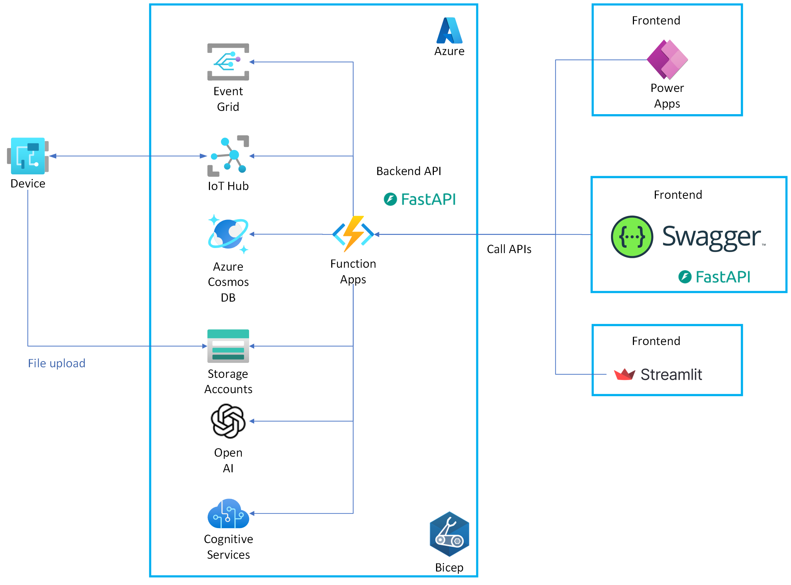

[](https://github.com/ks6088ts-labs/azure-ai-services-solutions/actions/workflows/test.yaml?query=branch%3Amain)
[](https://github.com/ks6088ts-labs/azure-ai-services-solutions/actions/workflows/infra.yaml?query=branch%3Amain)
[](https://github.com/ks6088ts-labs/azure-ai-services-solutions/actions/workflows/docker.yaml?query=branch%3Amain)
[](https://github.com/ks6088ts-labs/azure-ai-services-solutions/actions/workflows/docker-release.yaml)

# azure-ai-services-solutions

This repository contains a collection of solutions that leverage Azure AI services.

## Prerequisites

- [Python 3.10+](https://www.python.org/downloads/)
- [Poetry](https://python-poetry.org/docs/#installation)
- [GNU Make](https://www.gnu.org/software/make/)

## Architecture

[](./docs/architecture.png)

## Development instructions

### Local development

Use Makefile to run the project locally.

```shell
# Launch backend API server
make backend

# Launch frontend app server
make frontend

# Azure Functions
make azure-functions-start
```

### Docker development

See the actual implementation in the [compose.yaml](./compose.yaml) file.

```shell
# Launch backend API server
docker compose up backend

# Launch frontend app server
docker compose up frontend
```

### Run local test

Currently almost all tests won't run on CI because it consumes Azure resources.
To run the tests locally, follow the steps below.

```shell
# Run test if RUN_TEST is defined
export RUN_TEST=1

make test
```

## Deployment instructions

```shell
# Deploy Azure resources via Bicep
cd infra
make deploy
```

Azure Functions are deployed using the following commands.

```shell
# Deploy Azure Functions
make azure-functions-deploy
# Publish Azure Functions
make azure-functions-publish
```

### Push docker image to Docker Hub

To publish the docker image to Docker Hub via GitHub Actions, you need to set the following secrets in the repository.

```shell
gh secret set DOCKERHUB_USERNAME --body $DOCKERHUB_USERNAME
gh secret set DOCKERHUB_TOKEN --body $DOCKERHUB_TOKEN
```
