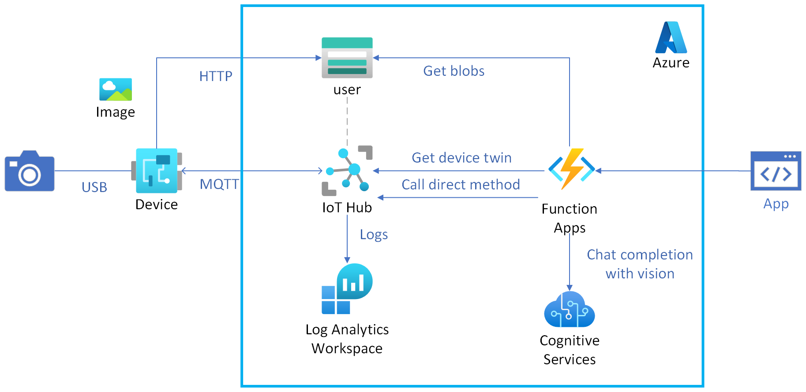

# IoT

## アーキテクチャ図

## ユーザーストーリー

- ユーザーは、IoT デバイスにコマンドを発行できる (Direct Method)
- ユーザーは、IoT デバイスの状態を取得できる (Device Twin)
- ユーザーは、IoT デバイスが撮影した画像を取得できる (Blob Storage)
- ユーザーは、IoT デバイスで撮影した画像を LLM に説明させることができる (GPT-4o)
